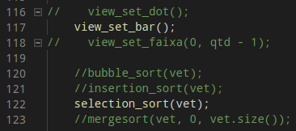

## 1. Simulando o Visualgo:
* O projeto apresenta os seguintes métodos de ordenação:
  * Bubble Sort
  * Insertion Sort
  * Selection Sort
  * Merge Sort 

## 2. Para selecionar um método:
- Para selecionar um método basta ir no arquivo ```main.cpp``` descomentar o mesmo. Certifique-se que apenas um método está selecionado, assim como a imagem a seguir.
<p align="center">
  
</p>

- Temos também 2 métodos de visualização do algoritmo, com barras e pontos, basta selecionar um, comentando os outros não utilizados, assim como na imagem.

## 3. Como rodar a aplicação:

- Para utilizar a aplicação é necessário primeiramente baixar a biblioteca gráfica que utilizamos,para isso basta rodar no terminal o seguinte comando :
```
  sudo apt-get install libsfml-dev
```
- Logo depois disso basta entrar na pasta da aplicação e rodar o comando ```make```,pois já foi feito um makefile visando facilitar a execução do projeto.Depois de executar o makefile,é necessário executar o que foi compilado,utilizando ```./main``` no terminal.


